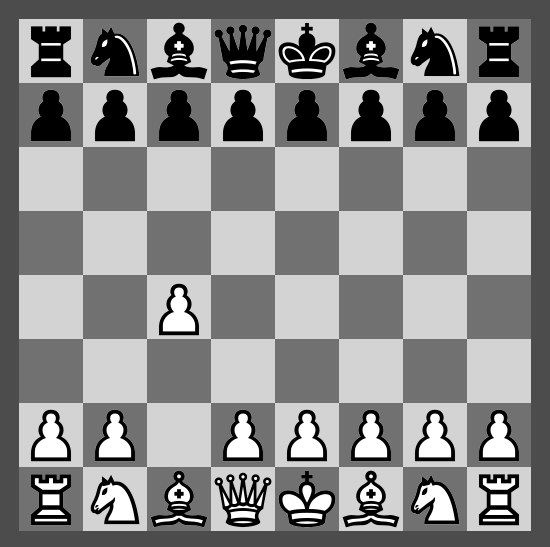

# Godot Chess

This project implements a PC chess board GUI compatible with UCI protocol to interface with chess engines.

The mouse is used to select, drag, and drop chess pieces around the board.

Each attempted move is evaluated for validity before the chess piece may be dropped into a new position.

Pieces may be taken and removed from the board.

Checks are made for:
* castling where a King is moved 2 steps horizontally
* check of a Queen
* check mate
* pawn promotion
* valid moves

A log of moves will be maintained.

There will be saving and loading of game moves.

When loading or inputing move data, the board may be initialized to a state other than the default starting positions.

## Chess Engine Interface

There are various Chess Engines available that use a standard interface protocol called UCI (Universal Chess Interface). We will use them as stand-alone applications (integration would entail using the source code and adhering to it's potentially restrictive licence).

See notes on UCI here:  [Engine Interface](docs/engine-interface.txt)

A UDP (User Datagram Protocol) server program is used to communicate with UCI programs (chess engines). This is written in Golang (so as to be able to capture stdout data from a non-blocking process) whereas the GUI is developed in Godot Engine using GDScript.

The Chess Engines (CEs) have a command line interface (CLI) so we may pipe data in through stdin and out from stdout. The CE will be executed as a sub process from our UDP server which communicates with the CE. When the server shuts down, it will kill the sub-process.

The UDP server will listen on a particular port on the localhost for incoming data packets from a UDP client, and will pipe this data to a stdin pipe to the CE. When the CE produces output text, this is piped to the server from stdout and sent to the UDP client.

The UDP client is part of the Godot GUI application.

## Components
The game consists of three programs:
* GUI
* UDP Server
* Chess Engine

## Building
Requirements are:
* Godot Engine 3.x
* Go

Directories to be created (not under source control):
* engine - to store the chess engine program to be used
* bin - to store the compiled executables (the game only uses iopiper)

The golang source code is in: `src/engine/`
The godot source code is in: `src`

On the command line type: **make** to build the go applications into the `bin` directory.

In the Godot Editor: export for the PC/Linux/Mac.

Download a Chess Engine such as: [Stock Fish](https://stockfishchess.org/download/) to the `engines` directory.

To try out the Chess Engine there is a Bash Script `./runengine`
Enter `uci` to see information. Then `quit` to exit.

## Testing
`src/engine/sampler.go` is a program to echo back what is entered on the command line. Ctrl+c to exit.

`src/engine/ping-server.go` is a program to act as a UDP server that pings back what it receives from a UDP client

`src/engine/iopiper.go` is a program to act as a UDP server that pipes data between a UDP client and CLI program. This is UDP Server component of the solution.

`src/engine/TestUDPClient.tscn` is a Godot scene used to test the UDPClient scene in conjunction with `iopiper` (UDP server) and `sampler` (Chess Engine substitute). It has export vars for the paths to these programs. It starts the server and passes it the path to the engine. The server then starts the engine. Then it sends a text string and times out if no return datagram is received. Otherwise, it continually sends a count value until the scene is closed.

The test scene should also, terminate the sub-process of the UDP Server which in turn should terminate it's sub-process of the engine.

Now there is a `src/engine/TestChessEngine.tscn` to test the actual engine and extends an `Engine` class that finds the files rather than using the export vars to get the file paths.

A utility such as **Htop** is useful to monitor running processes. They may be displayed in a Tree, killed, and searched for.

